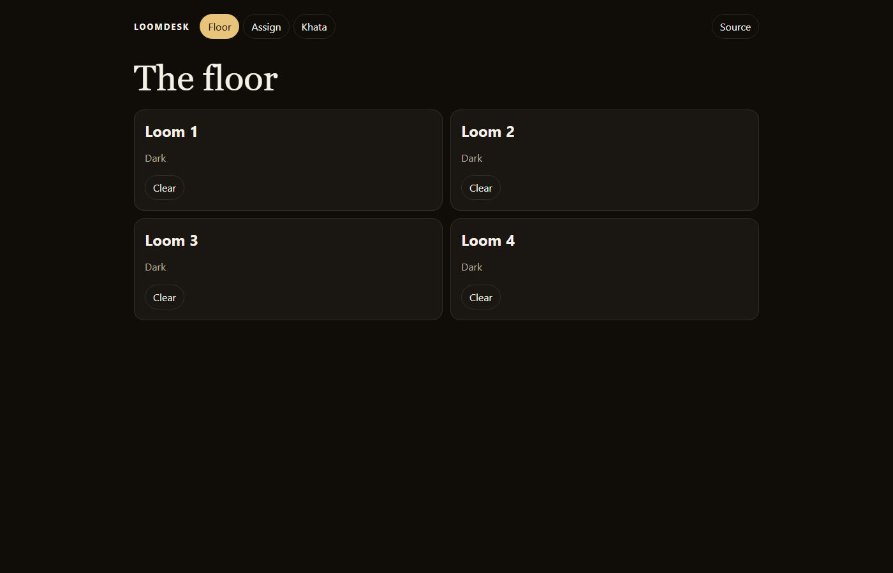

# LoomDesk

A mill desk for the web. The floor shows each loom, Assign lights a beam, and Khata keeps the open balance. Records stay in this browser after a refresh.



## Run it

Open [dhananisneh.github.io/loomdesk](https://dhananisneh.github.io/loomdesk/) or serve this folder.

```bash
npm test
```

## Author

[Sneh Dhanani](https://github.com/DhananiSneh) · [snehdhanani1@gmail.com](mailto:snehdhanani1@gmail.com)
